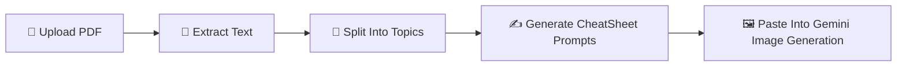

<div align="center">

# ✨ PDF CheatSheet Prompt Generator

<p>
  <strong>Turn any study PDF into beautifully structured Gemini image prompts for handwritten-style cheat sheets.</strong>
</p>

<p>
  
  
  
</p>

</div>

---

## 🖼️ Preview

<p align="center">
  
</p>

---

## 🌈 What this project does

This tool helps you go from **raw PDF notes** to **ready-to-paste Gemini prompts**.

It:
- uploads and reads your PDF in-browser,
- extracts text using PDF.js,
- splits content into logical study parts,
- generates one polished image prompt per part,
- lets you copy or download all prompts instantly.

---

## 🧠 Workflow at a glance



---

## 🎛️ Features

<table>
  <tr>
    <td>🧾 <strong>PDF Upload</strong></td>
    <td>Drag & drop or browse. Includes validation and progress feedback.</td>
  </tr>
  <tr>
    <td>🧰 <strong>Style Presets</strong></td>
    <td>Handwritten, Notes, or Mindmap output styles.</td>
  </tr>
  <tr>
    <td>📐 <strong>Orientation Control</strong></td>
    <td>Portrait or Landscape prompts for better layout control.</td>
  </tr>
  <tr>
    <td>📋 <strong>Fast Export</strong></td>
    <td>Copy one prompt, copy all prompts, or download as a text file.</td>
  </tr>
  <tr>
    <td>🖥️ <strong>No Build Step</strong></td>
    <td>Pure single-file app. Open <code>index.html</code> and go.</td>
  </tr>
</table>

---

## 🚀 Quick start

```bash
# 1) Clone
git clone https://github.com/rishwebb/PDF-CheatSheet.git

# 2) Open the project folder
cd PDF-CheatSheet

# 3) Run locally (any static server)
python3 -m http.server 8000
# then open http://localhost:8000
```

Or simply open `index.html` directly in your browser.

---

## 🛠️ Tech

- **Frontend:** HTML, CSS, Vanilla JavaScript
- **PDF parsing:** [PDF.js](https://mozilla.github.io/pdf.js/)
- **AI target:** Gemini image generation prompts

---

## ✅ Why students like it

- Converts long PDFs into manageable visual study chunks
- Produces consistent prompt quality for image generation
- Saves time when preparing revision cheat sheets
- Works without complicated setup

---

## 📄 License

MIT — see [`LICENSE`](./LICENSE).
